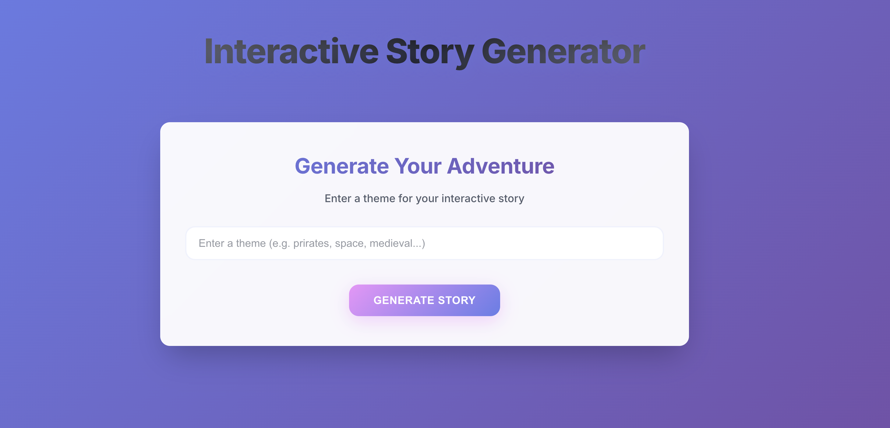

# 🎭 Choose Your Adventure - Interactive Story Generator

> *Where every choice writes a new chapter, and AI becomes your co-storyteller*

Welcome to the ultimate choose-your-own-adventure experience! 

> **AI-Powered Storytelling**: Using OpenAI's GPT-4o-mini to craft engaging narratives on the fly  
> **Your Theme, Your Rules**: Start with any theme - from space pirates to medieval mysteries  
> **Real-time Generation**: Watch stories unfold as you make choices  
> **Infinite Possibilities**: Every playthrough is unique  

## 🚀 How It Works

1. **Pick Your Theme**: Anything from "underwater detective" to "robot chef romance"
2. **AI Crafts Opening**: GPT-4o-mini creates your story's beginning
3. **Make Choices**: Select from multiple paths at each story node
4. **Watch Magic Happen**: New chapters generate based on your decisions
5. **Endless Adventures**: Every choice creates a new narrative branch

## 🛠️ Getting Started

### Prerequisites
- Python 3.12+
- Node.js 18+
- OpenAI API key (for the storytelling magic)